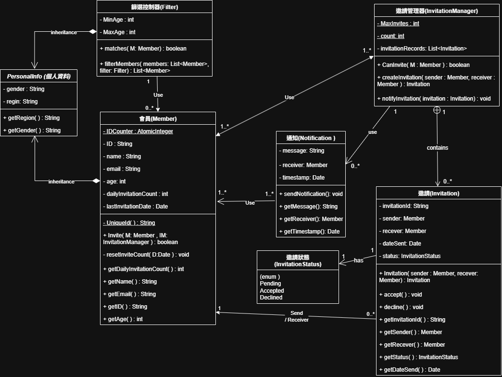

## 交友邀請系統－類別圖設計說明
本專案以 交友邀請系統 為核心，設計一套具完整邏輯的類別架構。系統透過物件導向分析與設計方法，建構出多個互相關聯的類別，用以管理會員資訊、篩選條件、邀請流程與通知功能。以下為各類別說明與關聯摘要，並包含對應的 UML 類別圖（PlantUML 語法可見於專案內部檔案）。

---
## 類別圖


---
## 🧱類別架構概覽
本系統包含以下類別與一個列舉型別：
- PersonalInfo（抽象基底類別）
- Member（會員）
- Filter（篩選控制器）
- InvitationManager（邀請管理器）
- Invitation（邀請，為內部靜態類別）
- Notification（通知）
- InvitationStatus（邀請狀態列舉）

### PersonalInfo（個人資料，抽象類別）
抽象的個人資料類別，提供共用的性別（gender）與地區（region）屬性，以及對應的 getter 方法。此類別由 Member 和 Filter 繼承，避免程式碼重複。
1. 屬性：
   - gender：指定性別（可為 male、female 或不限）。
   - region：地理區域（如「Taipei」、「Kaohsiung」等）。
2. 方法：
   - getGender()
   - getRegion()

### 📘 會員（Member）類別
描述系統中的會員，其屬性涵蓋基本個人資料與邀請功能的相關控制欄位。
1. 屬性：
   - `IDCounter`：使用 Java 內建的 AtomicInteger 類別，可在多執行緒環境下安全地執行遞增操作，確保每位會員擁有唯一且不重複的 ID。
   - `ID`：唯一識別碼
   - `name`：姓名
   - `email`：電子郵件
   - `age`：年齡
   - `dailyInvitationCount`：當日已發邀請次數
   - `lastInvitationDate`：最後邀請日期
2. 方法：
   - `UniqueId()`：私有靜態方法，自動產生類似 `U001` 的識別碼。
   - `invite(User u, InvitationManager manager)`：發送邀請前先檢查是否需重置邀請次數，再透過 `InvitationManager` 發送邀請。
   - 其他是各種 get 方法取得屬性值。

---

### 🧩 篩選控制器（Filter 類別）
用於定義篩選條件，過濾符合年齡、性別與地區條件的使用者。

1. 屬性：
   - minAge, maxAge：年齡上下限。

2. 方法：
   - `matches(Member Member)`：用來判斷該名使用者是否符合所有條件，包含年齡範圍、性別與地區是否相符（或不限）。
   - `filterMembers(List< Member>, Filter)`：方法，會接收一組會員清單與一組篩選條件，將所有符合條件的會員過濾出來並以清單方式回傳。

---

### 📬 邀請管理器（InvitationManager 類別）
InvitationManager 類別負責管理會員之間的邀請行為，包括：檢查是否可發送邀請、建立邀請紀錄、發送通知等功能，並保存所有歷史邀請資料。此類別同時內含一個靜態內部類別 Invitation，用於描述單一筆邀請資訊。

1. 屬性：
   - `MaxInvites`：用以限制單一會員每日最多可發送的邀請次數，預設為 10 次。
   - `counter`：使用 `AtomicInteger`，確保邀請 ID 在多執行緒中唯一遞增的編號。
   - `invitationRecords`：用於儲存所有建立過的邀請物件，做為歷史紀錄參考。
2. 方法：
   - `canInvite(User user)`：檢查使用者當日邀請次數是否尚未達上限，回傳布林值。
   - `createInvitation(User sender, User receiver)`：建立一筆新的邀請紀錄，使用內部類別 `Invitation` 建立邀請物件，先儲存至 `invitationRecords`，再呼叫 `notifyInvitation()` 方法發送邀請通知，最後回傳建立的邀請物件。
   - `notifyInvitation(Invitation invitation)`：將邀請資訊轉換為訊息文字，並透過 `Notification` 類別發送通知給邀請的接收者。。
   - `getInvitationRecords()`：回傳目前所有邀請清單。

---

### 📄 邀請（Invitation 類別）
定義為 `InvitationManager` 類別中的靜態內部類別，用於封裝單一邀請資訊，包含發送人、接收人、邀請狀態及發送時間等欄位。

1. 屬性：
   - `invitationId`：由 `AtomicInteger` 自動遞增產生，如 "INV1"。
   - `sender` / `receiver`：發送者與接收者皆為 `User`。
   - `status`：狀態為 `InvitationStatus` 列舉（Pending, Accepted, Declined）。
   - `dateSent`：邀請建立時間。
2. 方法：
   - `accept()`：將邀請的狀態設為 Accepted（已送出邀請）。
   - `decline()`：將邀請的狀態設為 Declined（取消送出邀請）。
   - 各種 get 方法取得屬性。

---

### 🔔 通知（Notification 類別）

模擬通知功能，當收到邀請時，將透過 `System.out.println()` 顯示相關訊息。

1. 屬性：
   - `message`：通知內容
   - `receiver`：接收者
   - `timestamp`：寄送時間
2. 方法：
   - `sendNotification()`：透過 `System.out.println()` 模擬通知被寄送。
   - 提供基本 getter 方法：`getMessage()`、`getReceiver()`、`getTimestamp()`。

---

### 🔔 邀請狀態（InvitationStatus 列舉）
1.	Pending：尚未處理。
2.	Accepted：已發送邀請。
3.	Declined：已取消邀請。

---

### 🔗 類別關聯說明

## 📚 類別關係總覽

| 類別關係 | 關係型態 | 說明 |
|----------|----------|------|
| `Member → PersonalInfo`<br>`Filter → PersonalInfo` | Generalization（Inheritance） | `Member` 與 `Filter` 類別繼承 `PersonalInfo`，共用 `gender` 與 `region` 屬性。 |
| `Filter 1 → 0..* Member` | Dependency | `Filter` 使用 `Member` 資料作篩選比對。一個 `Filter` 可比對 0 個以上 `Member`。 |
| `InvitationManager 1..* ←→ 1..* Member` | Dependency | `InvitationManager` 操作 `Member` 檢查邀請條件，`Member` 亦透過其發送邀請。多個 `Member` 可共用多個 `InvitationManager`。 |
| `InvitationManager 1 → 0..* Invitation` | Association | 每個 `InvitationManager` 擁有多筆 `Invitation` 記錄，負責管理邀請生命週期。 |
| `Invitation 0..* → 1 Member` | 關聯（Association） | 每筆 `Invitation` 包含 `sender` 與 `receiver`（皆為 `Member`）；而每位 `Member` 可出現在多筆邀請中。 |
| `Invitation 1 → 1 InvitationStatus` | 列舉 Association | `Invitation` 狀態由 `InvitationStatus` 列舉控制，限制值為 `Pending`、`Accepted` 或 `Declined`。 |
| `InvitationManager 1 → 0..* Notification` | Dependency | `InvitationManager` 建立並發送 `Notification` 通知接收者新邀請。 |
| `Notification 1..* → 1..* Member` | Dependency | 每個通知指向一位或多位 `Member`，顯示邀請訊息。 |

---

## 🔗 類別關聯圖（UML）

下圖為本系統之 UML 類別圖（使用 PlantUML 編寫）：  

> 💡 你可以將以下 PlantUML 程式碼貼至 [PlantUML 線上工具](https://www.plantuml.com/plantuml/) 或使用 VS Code 插件 `PlantUML` 即時預覽類別圖。

<details>
<summary>點我展開 UML 程式碼</summary>

```plantuml
@startuml
'===================
' Enum
'===================
enum InvitationStatus {
    Pending
    Accepted
    Declined
}

'===================
' Classes
'===================
abstract class PersonalInfo {
    - gender: String
    - region: String

    + getGender(): String
    + getRegion(): String
}

class Member {
    {static} - IDCounter: AtomicInteger
    - ID: String
    - name: String
    - email: String
    - age: int
    - dailyInvitationCount: int
    - lastInvitationDate: Date

    {static} - UniqueId(): String
    + Invite(M: Member, IM: InvitationManager): boolean
    - resetInviteCount(D: Date): void
    + getDailyInvitationCount(): int
    + getEmail(): String
    + getID(): String
    + getAge(): int
}

class Filter {
    - minAge: int
    - maxAge: int

    + matches(U: Member): boolean
    + filterMembers(Members: List<Member>, filter: Filter): List<Member>
}

class InvitationManager {
    {static} - MaxInvites: int
    {static} - count: int
    - invitationRecords: List<Invitation>

    + canInvite(U: Member): boolean
    + createInvitation(sender: Member, receiver: Member): Invitation
    + notifyInvitation(invitation: Invitation): void
    + getInvitationRecords(): List<Invitation>
}

class Invitation {
    - invitationId: String
    - sender: Member
    - receiver: Member
    - dateSent: Date
    - status: InvitationStatus

    + Invitation(sender: Member, receiver: Member)
    + accept(): void
    + decline(): void
    + getInvitationId(): String
    + getSender(): Member
    + getReceiver(): Member
    + getStatus(): InvitationStatus
    + getDateSent(): Date
}

class Notification {
    - message: String
    - receiver: Member
    - timestamp: Date

    + sendNotification(): void
    + getMessage(): String
    + getReceiver(): Member
    + getTimestamp(): Date
}

'===================
' Relationships
'===================
PersonalInfo <|-- Member
PersonalInfo <|-- Filter

Filter "1"-->"0..*" Member : Use
InvitationManager "1..*"<-->"1..*" Member : Use
InvitationManager "1"+--"0..*" Invitation : contains
InvitationManager "1"-->"0..*" Notification : Use
Invitation "0..*"-->"1" Member : Sender/Receiver
Invitation "1"-->"1" InvitationStatus : has
Notification "1..*"-->"1..*" Member : receiver
@enduml

</details>```
<br>
---

